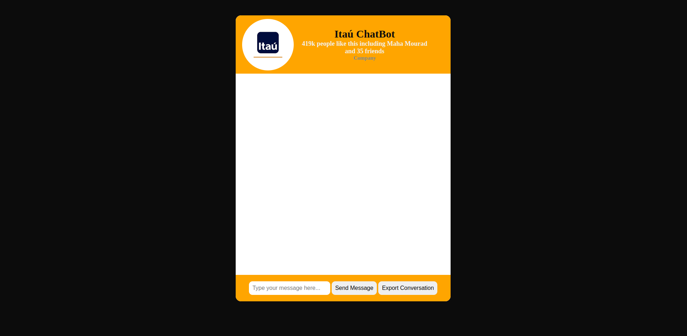

<h1 align="center"> Itaú ChatBot </h1>

  <a href="#-technologies">Technologies</a>&nbsp;&nbsp;&nbsp;|&nbsp;&nbsp;&nbsp;
  <a href="#-project">Project</a>&nbsp;&nbsp;&nbsp;|&nbsp;&nbsp;&nbsp;
  <a href="#-layout">Layout</a>&nbsp;&nbsp;&nbsp;&nbsp;&nbsp;&nbsp;
  

 

## 🚀 Technologies

This [Project](https://itau-chatbot.vercel.app/) fwas developed with the following technologies:

- HTML e CSS
- JavaScript

## 💻 [Project](https://itau-chatbot.vercel.app/)

Project developed for the Lexart Labs selection process for the Full Stack Developer vacancy.

Go to this project [LINK](https://itau-chatbot.vercel.app/).

Made with ♥ by Suelem Macedo.
